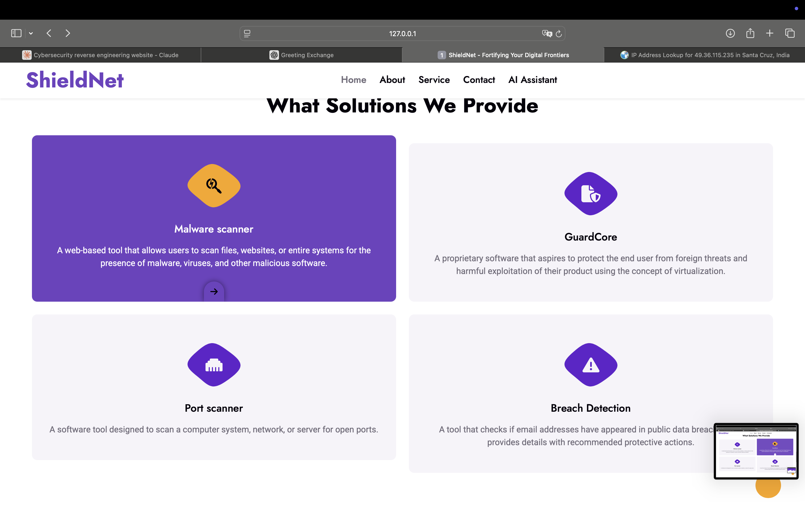

# ShieldNet

A unified web-based cybersecurity platform that combines malware analysis, breach detection, port scanning, code protection, and an AI-powered security assistant into a single dashboard.

## Features

- Malware Scanner
- Breach Detection
- Port Scanner
- Code Protection
- AI Security Assistant
- Security Knowledge Base

## Tech Stack

- Python
- Flask
- HTML/CSS/JavaScript
- Bootstrap
- SQLite
- Google Gemini API

## Screenshots

### Dashboard


### Breach Detection


### Malware Scanner


### port scanner


## Installation

```bash
git clone https://github.com/singhparth866/ShieldNet.git
cd ShieldNet
pip install -r requirements.txt
python app.py